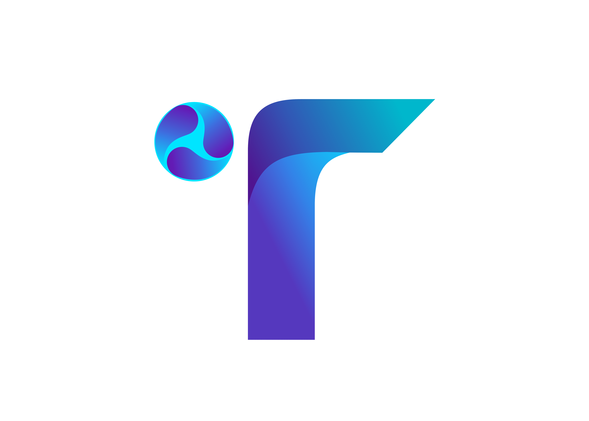

# TECHMINDSVERSE OS

<p align="center">
  
</p>

<p align="center">
  <strong>The Operating System for Builders, Developers, Creators & Digital Innovation.</strong>
</p>

---

# Overview

TechMindsVerse OS is a modern digital ecosystem built to connect:

- Learning
- Building
- Collaboration
- Innovation
- Community
- Automation
- AI Systems
- Product Development

into one unified operating system.

This is not just a website.

TechMindsVerse OS is designed as a scalable ecosystem where users can:

- Learn digital skills
- Enroll into academy tracks
- Build products
- Submit projects
- Access dashboards
- Collaborate with teams
- Receive support
- Track growth
- Interact with future AI systems
- Monetize skills
- Launch startups
- Connect with opportunities

---

# Ecosystem Structure

```txt
Website
   ↓
Authentication System
   ↓
User Dashboard
   ↓
Ecosystem Access
```

After account creation and activation, users gain access to different areas of the ecosystem based on their role and status.

---

# Current System Modules

## Academy

A structured learning platform for:

- Frontend Development
- Backend Development
- Fullstack Engineering
- AI & Automation
- UI/UX
- Product Design
- Digital Skills

Features:
- Enrollment system
- Payment verification
- Student dashboard
- Project submissions
- Progress tracking
- Future certificates

---

## Build Studio

A digital solution request system where users can:

- Request websites
- Request mobile apps
- Request branding
- Request automation systems
- Request startup MVPs
- Submit project requirements

Features:
- Build request form
- Admin management
- Status tracking
- Future AI estimations
- Team collaboration

---

## Admin OS

Central control system for platform operations.

Features:
- Payment approvals
- Student management
- Build management
- Complaints management
- Contact management
- User monitoring
- Ecosystem moderation

Future:
- Analytics
- AI moderation
- Automated workflows
- Staff hierarchy
- System monitoring

---

# Authentication Flow

## Current Flow

```txt
Register
   ↓
Activation Email
   ↓
Password Setup
   ↓
Login
   ↓
Dashboard Access
```

Users can access parts of the ecosystem without payment, but advanced features remain locked until verification/payment approval.

---

# Platform Philosophy

TechMindsVerse is built around:

- Real-world execution
- Learning by building
- Digital ownership
- Community growth
- Innovation systems
- Long-term scalability

The goal is to evolve from:

```txt
Website
→ Platform
→ Ecosystem
→ Operating System
```

---

# Tech Stack

## Frontend

- Next.js
- TypeScript
- TailwindCSS
- Zustand
- Axios
- Framer Motion
- PWA Support

---

## Backend

- NestJS
- TypeScript
- JWT Authentication
- Supabase
- PostgreSQL
- Nodemailer
- REST APIs

---

## Infrastructure

- Vercel (Frontend)
- Render (Backend)
- Supabase (Database & Storage)
- GitHub (Version Control)

---

# Project Structure

```txt
techmindsverse/
│
├── frontend/
│   ├── app/
│   ├── components/
│   ├── lib/
│   └── public/
│
├── backend/
│   ├── src/
│   │   ├── modules/
│   │   ├── common/
│   │   └── config/
│   └── dist/
│
└── README.md
```

---

# Current Features

## Completed

- Authentication system
- Role-based access
- Admin dashboard
- Academy enrollment flow
- Build request flow
- Contact system
- Complaint system
- Payment verification
- Email activation flow
- JWT authentication
- Mobile responsiveness
- PWA setup

---

# Upcoming Features

## Phase 2 — Intelligence

- Analytics dashboard
- Student scoring
- AI-powered recommendations
- Course tracking
- Documentation center
- Certificates
- Blog system
- Notification system

---

## Phase 3 — Automation & Scale

- AI agents
- AI support assistant
- Automated estimations
- Marketplace
- Affiliate systems
- Community feed
- Mobile apps
- Hiring system
- Product launch infrastructure

---

# Security

TechMindsVerse OS follows secure architecture principles:

- JWT Authentication
- Protected routes
- Role guards
- Secure backend APIs
- Email activation
- Password hashing
- Environment variable protection

Payments are currently verified manually for added security.

---

# Development Setup

## Clone Repository

```bash
git clone https://github.com/Techmindsverse/techmindsverseOs.git
```

---

# Frontend Setup

```bash
cd frontend
pnpm install
pnpm dev
```

---

# Backend Setup

```bash
cd backend
pnpm install
pnpm start:dev
```

---

# Environment Variables

## Frontend

```env
NEXT_PUBLIC_API_URL=
```

---

## Backend

```env
PORT=
JWT_SECRET=

SUPABASE_URL=
SUPABASE_SERVICE_ROLE_KEY=

SMTP_HOST=
SMTP_PORT=
SMTP_USER=
SMTP_PASS=
MAIL_FROM=

FRONTEND_URL=
ADMIN_EMAIL=
```

---

# Deployment

## Frontend

Deploy on:

- Vercel

---

## Backend

Deploy on:

- Render

---

# Roadmap

## Phase 1 — Foundation
Core platform launch.

## Phase 2 — Intelligence
Analytics, AI assistance, ecosystem tracking.

## Phase 3 — Automation & Scale
AI agents, mobile apps, automation systems, marketplace.

---

# Contribution

Currently private/internal development.

Future community contribution system planned.

---

# Founder

## Nliam Shedrack

Founder & CEO of TechMindsVerse

Focused on:
- Digital ecosystems
- AI systems
- Product innovation
- Developer communities
- Scalable technology infrastructure

---

# Vision

To build Africa’s next generation digital innovation ecosystem where people can:

- Learn
- Build
- Collaborate
- Monetize
- Innovate
- Scale

inside one connected operating system.

---

# Status

🚧 Active Development

TechMindsVerse OS is currently evolving rapidly with continuous architecture upgrades and ecosystem expansion.

---

# License

Private Proprietary Software — TechMindsVerse © 2026
